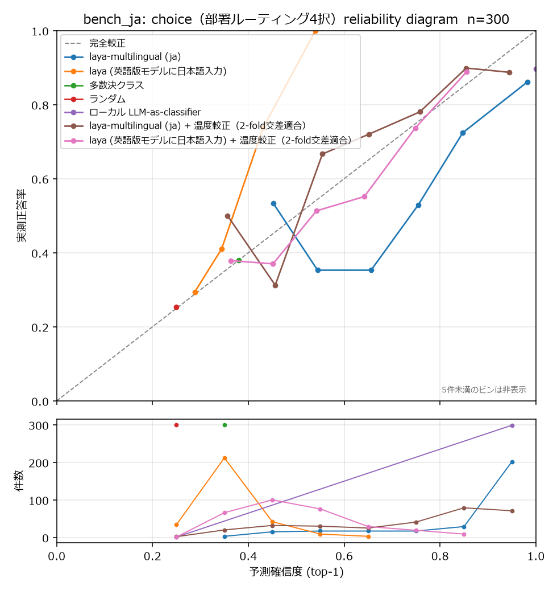

# 日本語 System One ベースライン実測 (`bench_ja`)

> **この文書の数値はすべて本機で実行したコードの出力です。** 推定値・引用値は一切ありません
> （SOKUDAN_SPEC.md §1-1）。未測定の項目は明示的に「測定していない」と書きます。

実測日: **2026-09-20**
生データ: [`baseline_ja_results.json`](data/baseline_ja_results.json) /
[`baseline_ja_breakdown.json`](data/baseline_ja_breakdown.json) /
[`baseline_ja_diagnostics.json`](data/baseline_ja_diagnostics.json)
評価セット: [`data/bench_ja.jsonl`](../data/bench_ja.jsonl)（300 件、全文をリポジトリに同梱）

再現コマンド:

```bash
uv sync --extra dev --extra bench
cp .env.example .env            # SOKUDAN_LOCAL_LLM_* を設定
uv run python scripts/build_bench_ja.py --n 300 --out data/bench_ja.jsonl
uv run python scripts/run_baseline_ja.py --bench data/bench_ja.jsonl --out runs/baseline_ja
uv run python scripts/analyze_baseline_ja.py
uv run python scripts/probe_laya_diagnostics.py
```

---

## 1. なぜこの計測をするのか

日本語で、**同一の 300 件・同一の質問**に対して既存の System One 系モデルがどう振る舞うかの
公開実測が見当たらない。作る前にこれを測り、「日本語が空白地帯である」という
本プロジェクトの前提が正しいかを確認する（SOKUDAN_SPEC.md §4.2 / Gate B）。

---

## 2. 測定環境

| 項目 | 値 |
|---|---|
| OS | Windows-10-10.0.26200-SP0 (Windows 11 Pro 26200) |
| Python | 3.11.9 |
| PyTorch | 2.11.0+cu128 |
| GPU | NVIDIA GeForce RTX 5090 (sm_120) |
| `laya` パッケージ | 0.3.4 |
| ローカル LLM | `qwen3:30b-a3b-instruct-2507-q4_K_M`（ollama 0.32.15, OpenAI 互換 API） |

---

## 3. `bench_ja` の作り方（ラベル条件付き生成）

正解ラベルを**先に**決め、ローカル LLM にそのラベルに合う日本語の業務文を書かせる。
生成条件そのものが正解なので、アノテーションも API 教師も要らない。

- 生成モデル: `qwen3:30b-a3b-instruct-2507-q4_K_M`、temperature **0.9**、seed 20260920
- 生成条件のランダム化: 業種 20 種 × 立場 12 種 × 文体 7 種 × 分量 3 段階 × チャネル 3 種
- **ラベル語の使用を禁止**: 「請求」「技術」「営業」「その他」「急がない」「早めに」
  「業務が止まっている」「解約」「緊急」を本文に含むものは破棄して再生成。
  これをやらないとベンチマークが単なるキーワード一致になる
- 生成 300 件、**採用 300 件**（破棄後の再試行を含め最大 8 回試行）。所要 263 秒
- 破棄の内訳: `leaked:請求` 21 / `leaked:早めに` 12 / `leaked:営業` 9 / `meta:以下` 1 / `leaked:技術` 1
- 平均文字数: 299.1 文字

各件に 3 問を付ける:

| 質問 | 型 | 選択肢 |
|---|---|---|
| `department` | `choice` | 請求 / 技術 / 営業 / その他 |
| `urgency` | `score` | 急がない → 早めに → 業務が止まっている（3段階の順序尺度） |
| `churn` | `bool` (`noul`) | 解約・契約終了を示唆しているか |

### 実際のラベル分布（実測）

一様ではなく、意図的に偏らせてある。一様だと多数決ベースラインが意味を失うため。

| department | 件数 (割合) | urgency | 件数 (割合) | churn | 件数 (割合) |
|---|---|---|---|---|---|
| 請求 | 114 (0.380) | 急がない | 77 (0.257) | true | 89 (0.297) |
| 技術 | 97 (0.323) | 早めに | 138 (0.460) | false | 211 (0.703) |
| 営業 | 51 (0.170) | 業務が止まっている | 85 (0.283) | | |
| その他 | 38 (0.127) | | | | |

`bench_ja` は **Phase 5 の未知スキーマテストセットの一部**であり、**学習には絶対に混ぜない**。

---

## 4. 比較対象

| # | 対象 | 測定 |
|---|---|---|
| 1 | `convaiinnovations/laya-multilingual`（日本語をそのまま入力） | 実施 |
| 2 | `convaiinnovations/laya`（英語版モデルに日本語を入力） | 実施 |
| 3 | 多数決クラス（`bench_ja` 自身の経験的事前分布） | 実施 |
| 4 | ランダム | 実施 |
| 5 | ローカル LLM-as-classifier（生成に使ったモデル自身、temperature 0） | 実施 |
| 6 | 1 と 2 に**事後の温度較正**を掛けたもの（2-fold 交差適合） | 実施 |
| — | **TypeSafe Jev** | **実測しない**（下記） |

### TypeSafe Jev を実測しない理由

TypeSafe の利用規約（Master Customer Agreement 2.3(b)）が、同サービスおよびその出力を類似製品の開発に用いることを禁じているため、本プロジェクトでは Jev を実測していない。
**このリポジトリには Jev を呼ぶコードが存在しない。**
この欄には今後も数値を入れない。他所の公開値を転記することもしない。

> TypeSafe の公開ドキュメントは公開情報として参照してよいが、
> 本プロジェクトの設計根拠として引用する場合は「公開ドキュメントより」と出典を明記し、
> 自前の実測値と混同されない形で書く。

### 温度較正の行をなぜ足したか（公平性）

`laya-multilingual` のモデルカードは自ら **「Ships uncalibrated.
`temperature = [1.0, 1.0, 1.0]` with no per-option-count buckets. …
Do this on your own data before trusting the probabilities.」** と書いている。
出荷状態の ECE だけを載せるのは、作者自身が「そのまま信じるな」と言っている設定を
測ることになる。そこで **2-fold 交差適合**（半分で温度を当て、残り半分に適用、入れ替えて結合）で
較正した行を並べた。自分自身のデータで較正して自分自身を評価する不正はしていない。

---

## 5. 結果

### 5.1 精度・較正（n=300）

| 対象 | choice acc | choice ECE | choice Brier | score RPS | score acc | score MAE | bool acc | bool ECE | パース失敗率 |
|---|---|---|---|---|---|---|---|---|---|
| **laya-multilingual (ja)** | **0.747** | 0.148 | 0.399 | 0.232 | 0.443 | 0.620 | 0.543 | 0.352 | 0.0% |
| laya (英語版に日本語入力) | 0.467 | 0.108 | 0.660 | 0.200 | 0.460 | 0.603 | 0.303 | 0.634 | 0.0% |
| 多数決クラス | 0.380 | 0.000 | 0.706 | **0.197** | 0.460 | 0.540 | **0.703** | 0.000 | — |
| ランダム | 0.253 | 0.003 | 0.750 | 0.201 | 0.403 | 0.777 | 0.513 | 0.013 | — |
| ローカル LLM-as-classifier | 0.893 | 0.104 | 0.209 | 0.167 | 0.703 | 0.333 | 0.870 | 0.130 | 0.1% |
| laya-multilingual + 温度較正 | 0.747 | **0.087** | 0.374 | 0.196 | 0.443 | 0.620 | 0.543 | **0.012** | 0.0% |
| laya (en) + 温度較正 | 0.467 | 0.058 | 0.638 | 0.198 | 0.460 | 0.603 | 0.303 | 0.242 | 0.0% |

`score` の RPS は **低いほど良い**。他は acc が高いほど、ECE / Brier / MAE は低いほど良い。
温度較正は単調変換なので argmax を変えない。したがって acc / MAE は元の行と同一になる（仕様どおり）。

### 5.2 レイテンシ（同一マシン）

| 対象 | p50 (ms/件) | p95 (ms/件) | mean (ms/件) | questions/sec |
|---|---|---|---|---|
| laya-multilingual (ja) | 18.3 | 33.8 | 22.0 | 136.2 |
| laya (英語版に日本語入力) | 22.8 | 36.9 | 25.1 | 119.3 |
| ローカル LLM-as-classifier | 954.0 | 1110.0 | 968.6 | 3.1 |

1件 = 3問（choice / score / bool）。Laya は 3 問を 1 回の forward で処理するため
`questions/sec` は件数×3 から算出。LLM-as-classifier は 1 問 1 リクエスト（3 リクエスト/件）。

**Laya は LLM-as-classifier の約 44 倍速い**（22.0ms vs 968.6ms、mean）。
ただしこれは 30B の量子化モデルとの比較であり、モデル規模が違う。

### 5.3 reliability diagram（choice）



5 件未満のビンは曲線から除外している（1 件のビンは正答率 0.0 か 1.0 になり、
意味のない急峻な線を描くため）。下段の件数パネルには全ビンを表示しているので、
どのビンが薄いかは読み取れる。

---

## 6. 読み取れたこと

### 6.1 `choice`（部署ルーティング）は**日本語でも動く**

`laya-multilingual` は 0.747。ランダム 0.253 の約 **3.0 倍**、多数決 0.380 の約 **2.0 倍**。
これは「日本語で壊れている」とは言えない水準。

混同行列（gold 行 × pred 列）:

| gold \ pred | 請求 | 技術 | 営業 | その他 | 計 |
|---|---|---|---|---|---|
| 請求 | **80** | 13 | 19 | 2 | 114 |
| 技術 | 0 | **95** | 2 | 0 | 97 |
| 営業 | 0 | 5 | **45** | 1 | 51 |
| その他 | 1 | 17 | 16 | **4** | 38 |
| 計 | 81 | 130 | 82 | 7 | 300 |

弱点は「その他」で、38 件中 4 件しか当てられず、残りは技術(17) / 営業(16) に流れている。
予測分布の偏りとしては gold 0.127 に対し pred 0.023。
**「どれにも当てはまらない」という選択肢の扱いが弱い**、と読める。

### 6.2 `score`（順序尺度）は多数決を下回り、原因は**提示順の第1選択肢が選ばれないこと**

まず素の数字:

- RPS 0.232 に対し、**多数決 0.197 / ランダム 0.201**。つまり Laya は両方より悪い
- 正答率 0.443 に対し多数決 0.460。これも下回る
- 温度較正後でも RPS 0.196 で、ようやく多数決と同等

順序の混同（gold 行 → pred 列）:

| gold | → 急がない | → 早めに | → 業務が止まっている | 計 |
|---|---|---|---|---|
| 急がない | **0** | 58 | 19 | 77 |
| 早めに | **0** | 78 | 60 | 138 |
| 業務が止まっている | **0** | 30 | 55 | 85 |

300 件すべてで「急がない」が一度も選ばれていない。
ここで止めて「順序尺度が死んでいる」と書くのは早い。**3 つの説明があり得る**:
(1) 順序ヘッド自体が退化している、(2) 選択肢の**位置**を読んでいる、
(3) 「急がない」という特定の日本語表現の問題。

同じ 300 件に対し、**スキーマだけを変えた 5 条件**を追加実行して切り分けた
（`scripts/probe_laya_diagnostics.py`。下表は remap なしの**提示順そのまま**の集計）:

| 条件 | 提示した選択肢 | 提示順の argmax 件数 |
|---|---|---|
| A 原文 | 急がない / 早めに / 業務が止まっている | **[0, 167, 133]** |
| B 逆順 | 業務が止まっている / 早めに / 急がない | **[0, 50, 250]** |
| C 言い換え | 低 / 中 / 高 | **[1, 291, 8]** |
| D 言い換えの逆順 | 高 / 中 / 低 | **[1, 0, 299]** |
| E 4段階 | 全く急がない / 急がない / 早めに / 業務が止まっている | **[0, 78, 37, 185]** |

**5 条件すべてで、提示順の第1選択肢が 300 件中 0〜1 件しか選ばれていない。**
語の意味でも、順序の向きでも、段階数 (K=3/4) でもなく、**位置**で決まっている。

決定的なのは A と B の対比です。「急がない」は
**先頭に置かれると 0 件、末尾に置かれると 250 件**選ばれる。
同じラベル・同じ 300 件・同じ問いで、置き場所だけが違う。
モデルはラベルを拒否しているのではなく、**先頭スロットを拒否している**。

したがって正確な言い方は「順序尺度が機能していない」ではなく:

> **`score` の第1選択肢スロットが構造的に選ばれない位置バイアスがあり、
> その結果としてスキーマの書き方で精度が 0.270〜0.473 まで振れる。**

スキーマ間の振れ幅（同じ 300 件、同じ質問、表記だけ違う）:

| 条件 | accuracy | RPS↓ | MAE↓ | spearman(期待値, gold) |
|---|---|---|---|---|
| A 原文 | 0.447 | 0.232 | 0.617 | **0.314** |
| B 逆順 | 0.270 | 0.347 | 0.940 | 0.158 |
| C 低中高 | 0.473 | 0.214 | 0.530 | 0.192 |

スピアマン相関はいずれも **0.16〜0.31** で、順序情報を多少は拾ってはいる
（完全な無相関ではない）。ただしこの水準では実用にならない。

これは Laya のモデルカードの記述（英語で SST-5 0.282、`score` が最弱プリミティブ）と
方向として一致するが、**位置バイアスが原因であること**と
**日本語では多数決すら下回ること**は、ここで初めて測った。

> 補足: 3 問同時に投げた場合（本編の表）と `urgency` 単独で投げた場合（上の診断）で、
> 300 件中 1 件だけ argmax が動いた（accuracy 0.443 vs 0.447）。
> 「質問は互いに独立に評価される」という設計に対する小さな実測上の例外として記録しておく。

### 6.3 `bool`（解約示唆）は多数決を大きく下回る。**閾値のズレではなく、順位付けができていない**

- `laya-multilingual` 0.543 に対し多数決 0.703。**16 ポイント下**
- ECE 0.352（出荷状態）。温度較正で 0.012 まで下がるが、**正答率は 0.543 のまま**
- `laya`（英語版）は 0.303 で、ランダム 0.513 すら下回る
- 平均 P(true) は 0.434 に対し gold の true 率は 0.297。「解約を示唆している」側に倒れている

ここで「単に閾値が 0.5 からずれているだけでは？」という反論があり得る。
それなら順位付け自体は正しく、運用で閾値を動かせば直る話であって、「壊れている」は言い過ぎになる。
**閾値に依存しない指標で確かめた**（`scripts/probe_laya_diagnostics.py`）:

| 指標 | 値 | 意味 |
|---|---|---|
| gold の正例率 | 0.297 | 多数決精度 = 0.703 |
| **AUROC** | **0.523** | **0.5 = 無情報。ほぼ偶然と区別がつかない** |
| 精度 @ 閾値 0.5 | 0.543 | 出荷状態 |
| 精度 @ 正例率一致閾値 (0.8374) | 0.613 | 閾値を最適に動かしても… |
| 多数決 | 0.703 | **…まだ多数決に 9 ポイント届かない** |

**AUROC 0.523 は「順位付けができていない」ということ。** 閾値のズレではない。
予測正例数を gold の正例数にぴったり合わせるという、実運用では使えない有利な条件を与えても
0.613 にしかならず、多数決 0.703 を下回る。

したがって `bool` については**「壊れている」という表現を弱める必要はない**。
（この検証で AUROC が高く出ていたら「較正オフセットのズレ」に書き換える予定だった。
出なかったので、元の主張をそのまま残す。）

### 6.4 英語版チェックポイントは日本語で崩れる（カードの記述を日本語で再現）

`laya`（英語版）に日本語を入れると choice 0.467 / bool 0.303。
bool はランダム（0.513）を下回る。モデルカードが他言語について書いている
「degrade しない、collapse する」という記述は、日本語でもそのとおりだった。

### 6.5 較正は温度だけでかなり直る

`laya-multilingual` の choice ECE は 0.148 → **0.087**、bool ECE は 0.352 → **0.012**。
モデルカードが英語で報告している「0.314 → 0.106」と整合する方向。
**ただし精度は 1 ポイントも動かない**（温度は単調変換なので当然）。
「較正が悪い」と「精度が足りない」は別の問題である、という当たり前のことが数字で出ている。

---

## 7. 留意点（公平な比較のために）

- **`bench_ja` は合成データ**であり、実際の業務メールの分布とは異なる。
- ⚠️ **ローカル LLM-as-classifier は公平な比較対象ではない。上限の目安として読むこと。**
  `bench_ja` を生成したモデルと、LLM-as-classifier ベースラインのモデルは
  **同一（`qwen3:30b-a3b-instruct-2507-q4_K_M`）**である。
  つまりこのベースラインは、**自分が書いた文を、自分が与えられた生成条件に照らして
  分類し直している**。同じ重みが同じ語彙選択・同じ言い回しの癖を持っているので、
  他のどのモデルにも利用できない手がかりが残っている。
  したがって 0.893 / 0.870 という数字は、
  - ❌ 「日本語 System One の到達可能な精度」ではない
  - ❌ Laya や sokudan と同じ土俵に並べて優劣を論じてよい数字ではない
  - ⭕ 「このタスク設計で、生成条件がどれだけ文面に現れているか」の**上限の目安**
  これを対等な比較として引用すると誤りになる。表でも別枠として読んでほしい。
  （独立した第三のモデルを分類器に使えば公平な LLM ベースラインになるが、今日は測っていない。）
- **`laya` は英語向けチェックポイント**であり、日本語での低スコアは
  「日本語で学習されていない」ことの確認であって、モデルの品質一般の評価ではない。
  モデルカード自身が「英語以外にはこれを使うな、multilingual を使え」と明記している。
- `bench_ja` の質問は Laya に有利にも不利にも寄せていないが、
  `その他` のような「該当なし」選択肢を含む点は、
  選択肢を素直に読むタイプのモデルには難しい設計になっている可能性がある。
- **確率の分解能**: Laya API は確率を小数点以下 4 桁に丸めて返す。
  正解クラスに厳密な `0.0` が来ると NLL が発散するため、
  全ベースラインに**同一の下限 5e-5** を掛けて再正規化している（`PROB_FLOOR`）。
  これは測定側の都合であって、モデルの性質ではない。
- **単一シード**。`bench_ja` の生成は 1 回のみ。生成セットを変えたときの分散は測っていない。
  ただし**同じ 300 件に対する評価は完全に決定的**で、独立に 2 回実行して
  上表の全数値が小数第3位まで一致することを確認した（Laya は温度の概念がなく、
  LLM-as-classifier は temperature 0）。したがって上の数字に測定ノイズは含まれない。
- 温度較正行のレイテンシは元の行と同一値を再掲している（較正は事後の後処理で、
  推論時間に影響しないため）。
- レイテンシは他プロセス（ollama が VRAM に常駐）と同居した状態での実測。

---

## 8. Gate B の判定

> Gate B: 「`laya-multilingual` が日本語でまともに動いてしまった場合、
> このプロジェクトの前提（日本語が空白地帯）が崩れる。その事実を報告して止まること。」

**判定: 割れた。プリミティブごとに結論が逆になる。**

| プリミティブ | `laya-multilingual` | 多数決 | 判定 |
|---|---|---|---|
| `choice` | 0.747 | 0.380 | **まともに動いている**（多数決の約2.0倍、ランダムの約3.0倍） |
| `score` | RPS 0.232 / acc 0.443 | RPS 0.197 / acc 0.460 | **実用にならない**（多数決以下。原因は提示順の位置バイアス、§6.2） |
| `bool` | acc 0.543 / **AUROC 0.523** | 0.703 | **壊れている**（AUROC がほぼ偶然。閾値のズレではない、§6.3） |

したがって:

- **「日本語 System One は空白地帯」という前提は、`choice` については成立しない。**
  部署ルーティングのような素直な多クラス選択であれば、`laya-multilingual` は今日そのまま使える。
- **`score` と `bool` については前提が成立する。**
  - `bool` は AUROC 0.523 で順位付けができていない。閾値を gold の正例率に合わせても
    0.613 で多数決 0.703 に届かない。
  - `score` は多数決以下だが、原因は「順序ヘッドの退化」ではなく
    **提示順の第1選択肢が選ばれない位置バイアス**だった（5 スキーマ条件で確認）。
    同じ質問でも表記の置き方だけで accuracy が 0.270〜0.473 に振れる。

### この結果を受けた方針（2026-09-20 決定）

`sokudan` の目標を **`score` と `bool` で `laya-multilingual` を上回ること**に定める。
`choice` は測って報告するが、目標には置かない（既に実用水準のものを追いかけても意味がないため）。

設計上の含意:

- §6.3 の**動的 K の cumulative-link `score` ヘッドは切らない**。今日の実測で、
  ここが最も大きな空白だと確認できたため。
- 位置バイアスへの耐性が要件になる。§7.2 のスキーマランダム化で
  **選択肢の順序シャッフルは必須**（アブレーションは切るが、ランダム化自体は残す）。
- `bench_ja` の 3 スキーマとその言い換えは**学習データに一切入れない**。
